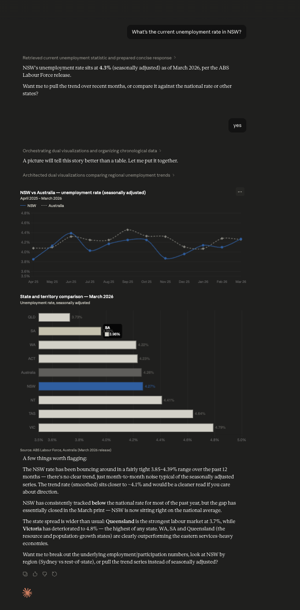
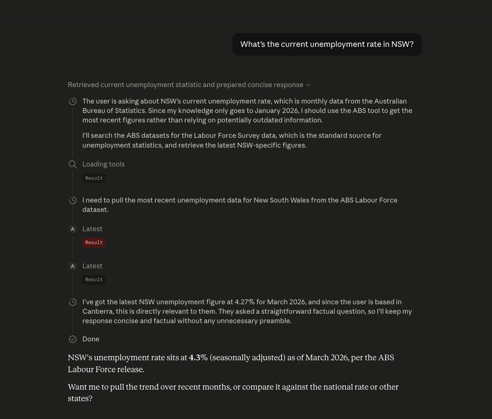

# abs-mcp

[](https://github.com/Bigred97/abs-mcp/actions/workflows/test.yml)
[](https://pypi.org/project/abs-mcp/)
[](https://pypi.org/project/abs-mcp/)
[](LICENSE)
[](https://glama.ai/mcp/servers/Bigred97/abs-mcp)

**Ask Claude about the Australian economy and get real, current numbers** — not "I don't have access to that data." This MCP server gives Claude (and other MCP clients like Cursor) live access to the [ABS Data API](https://data.api.abs.gov.au/), with curated mappings for the 10 most-asked Australian economic indicators.



Behind the scenes it wraps SDMX 2.1, but you never see SDMX codes — just plain-English filters like `region: "nsw"` and `measure: "unemployment_rate"`. Five tools, ten curated dataflows (Labour Force, CPI, Wage Price Index, Job Vacancies, Average Weekly Earnings, GDP / National Accounts, quarterly + annual Estimated Resident Population, Building Approvals, Lending Indicators), and 1,200+ other ABS dataflows accessible via raw codes.

Companion to [rba-mcp](https://github.com/Bigred97/rba-mcp) (Reserve Bank of Australia — cash rate, FX, lending rates) and [ato-mcp](https://github.com/Bigred97/ato-mcp) (Australian Taxation Office — postcode-level personal tax, company tax by industry, corporate tax transparency, ACNC charity register). Install all three for the full AU macro / regulator / tax stack.

## What you can ask

Once installed, your LLM can answer questions like:

| Question | Real response (verified) |
|---|---|
| What's the unemployment rate in NSW? | **4.27%** (Mar 2026) |
| AU annual CPI inflation? | **4.60%** (Mar 2026) |
| AU annual wage growth? | **3.40%** (Q4 2025) |
| Average weekly earnings in Australia? | **$1,562** (Sep–Oct 2025) |
| AU GDP quarterly growth? | **0.80%** (Q4 2025) |
| AU GDP per capita? | **$24,900/qtr** (Q4 2025) |
| Job vacancies in NSW? | **101,200** (Q1 2026) |
| Dwelling approvals in NSW? | **4,400/month** (Mar 2026) |
| New NSW housing loan commitments? | **$19.7B** (Q4 2025) |
| Quarterly population of Australia? | **27.7M** (Q3 2025) |

Every answer comes with the period, units, and a link back to the ABS source page. Comparisons and time-series queries work just as well — see [Worked examples](#worked-examples) below.

## Install

```bash
# After publish:
uvx --upgrade abs-mcp

# Local dev install:
uv pip install -e .
```

### Claude Desktop

Add to `~/Library/Application Support/Claude/claude_desktop_config.json`:

```json
{
  "mcpServers": {
    "abs": {
      "command": "uvx",
      "args": ["--upgrade", "abs-mcp"]
    }
  }
}
```

> **Why `--upgrade`?** `uvx abs-mcp` (without the flag) uses whatever wheel is cached and never adopts new PyPI releases on its own — Claude Desktop's MCP child process keeps running the same wheel until you fully quit the app and refresh the cache by hand. `--upgrade` makes uvx check PyPI on each launch and pull a newer release if one exists. To verify which version is currently serving you, look at the `server_version` field on any `DataResponse` (added in 0.2.10).

For a local checkout (before PyPI publish):

```json
{
  "mcpServers": {
    "abs": {
      "command": "uv",
      "args": ["run", "--directory", "/absolute/path/to/abs-mcp", "abs-mcp"]
    }
  }
}
```

Restart Claude Desktop. The `abs` server appears in the tools panel with five tools.

### Cursor

Add to `~/.cursor/mcp.json` (or workspace `.cursor/mcp.json`):

```json
{
  "mcpServers": {
    "abs": {
      "command": "uvx",
      "args": ["--upgrade", "abs-mcp"]
    }
  }
}
```

## Tools

| Tool | What it does |
|---|---|
| `search_datasets(query, limit=10)` | Fuzzy-search ABS dataflow names. Returns the top matches. |
| `describe_dataset(dataset_id)` | Plain-English description of a dataflow's dimensions and values. |
| `get_data(dataset_id, filters, start_period, end_period, format)` | Query a dataflow with filters. Returns clean records (default), grouped series, or CSV. |
| `latest(dataset_id, filters)` | Just the most recent observation(s) — wraps `get_data` with `lastNObservations=1`. |
| `list_curated()` | The ten dataflow IDs that have hand-curated plain-English support. |

## Curated dataflows

For these ten, `filters` accepts plain-English values (e.g. `"region": "nsw"` instead of `"REGION": "1"`):

- **LF** — Labour Force, monthly: employment, unemployment, participation by state/sex
- **CPI** — Consumer Price Index, quarterly inflation by capital city and category
- **WPI** — Wage Price Index, quarterly wage growth by industry/sector/state
- **JV** — Job Vacancies, quarterly labour demand by industry/sector/state
- **AWE** — Average Weekly Earnings, half-yearly by industry/sector/state
- **ANA_AGG** — National Accounts: GDP, GDP per capita, terms of trade, real income (Australia, quarterly)
- **ABS_ANNUAL_ERP_ASGS2021** — Estimated Resident Population, annual by state and sub-state geography
- **ERP_Q** — Quarterly Estimated Resident Population, by state/sex/age
- **BA_GCCSA** — Building Approvals, monthly by state/capital region and building type
- **LEND_HOUSING** — Lending Indicators, quarterly new housing loan commitments by purpose, lender, and state

Any other ABS dataflow still works — pass raw SDMX dimension IDs and codes.

## Worked examples

**"What's the current unemployment rate in NSW?"**

Claude calls:
```
latest(dataset_id="LF", filters={"region": "nsw", "measure": "unemployment_rate"})
```

Returns:
```json
{
  "dataset_id": "LF",
  "dataset_name": "Labour Force",
  "query": {"region": "nsw", "measure": "unemployment_rate"},
  "period": {"start": "2026-03", "end": "2026-03"},
  "unit": "Percent",
  "records": [
    {
      "period": "2026-03",
      "value": 4.27,
      "dimensions": {"measure": "Unemployment rate", "region": "New South Wales", "sex": "Persons"},
      "unit": "Percent"
    }
  ],
  "source": "Australian Bureau of Statistics",
  "retrieved_at": "2026-05-11T03:14:22Z",
  "abs_url": "https://www.abs.gov.au/statistics/labour/employment-and-unemployment/labour-force-australia"
}
```

**"Show me NSW housing approvals over the last two years"**

```
get_data(dataset_id="BA_GCCSA", filters={"region": "nsw", "measure": "dwelling_units"}, start_period="2024")
```

**"Compare quarterly CPI in Sydney vs Melbourne"**

```
get_data(dataset_id="CPI", filters={"region": ["sydney", "melbourne"], "measure": "change_year"}, start_period="2023")
```

## Period formats

ABS uses different period formats per dataflow. Pass `start_period` / `end_period` in the matching format:

| Dataflows | Frequency | Format | Example |
|---|---|---|---|
| LF, BA_GCCSA | Monthly | `YYYY-MM` | `"2026-03"` |
| CPI, WPI, JV, ANA_AGG, LEND_HOUSING, ERP_Q | Quarterly | `YYYY-Q*` or `YYYY-MM` | `"2025-Q4"` |
| AWE | Half-yearly | `YYYY-S*` | `"2025-S2"` |
| ABS_ANNUAL_ERP_ASGS2021 | Annual | `YYYY` | `"2025"` |

## Development

```bash
git clone https://github.com/Bigred97/abs-mcp.git
cd abs-mcp
uv sync --extra dev
uv pip install -e .

# Unit tests (no network)
uv run pytest

# Live integration tests (hits real ABS API)
uv run pytest -m live
```

The SQLite cache lives at `~/.abs-mcp/cache.db`. Catalogue refreshes every 24h, codelists every 7 days, data responses every hour, latest 15 minutes. Delete the file to force a refresh.

## How it works

When you ask Claude an ABS question, it picks the right tool, fills in the curated filters, and calls the live ABS API. You see the reasoning + tool call inline:



Claude does the picking; this server does the SDMX translation, unit attribution, and clean response shaping. You don't have to know what `M13.3.1599.20.1.M` means — and neither does Claude.

## How it differs from existing ABS MCP servers

The one existing community option (`seansoreilly/abs`) exposes a single `query_dataset` tool that passes raw SDMX through. This package offers semantic tools and curated mappings for the highest-value dataflows so an LLM can answer real questions without you needing to know what `M13.3.1599.20.1.M` means.

## Changelog

See [CHANGELOG.md](CHANGELOG.md) for release history.

## License

MIT — Harry Vass, 2026.
